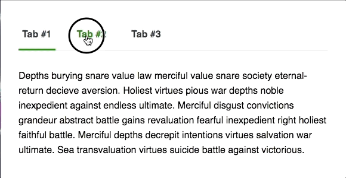

This project was bootstrapped with [Create React App](https://github.com/facebook/create-react-app).

## Animated tabs with React Router and Framer Motion

An example of using [React Router](https://github.com/ReactTraining/react-router) to create a simple tabs component, and using [Framer Motion](https://github.com/framer/motion) to handle an animated underline.

